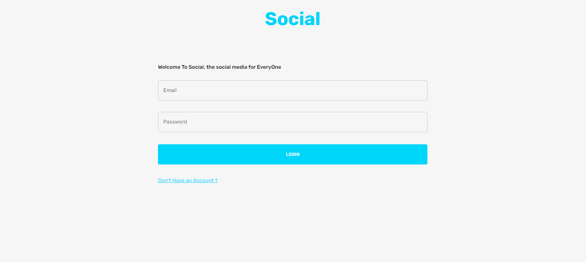

<h1> Social Media Site </h1>


## Its a Social Media Site just like facebook and instagram which lets you make friends Interact with those friends 

# What we mean by Interaction

 1. Make Friends By Sending Them Friend Request. If they accepted Your Request Now you Both are Friends Yayy..

 2. Also Like Functionality is There So you could like there Amazing Pictures and comment on there Pictures As Well


 ### Functionality Of Login
 -------------------------------------------------------------------------

 
        

## How Can You Start The Application Locally

1 - Clone the Repository Into your Local Machine

``` javascript
    git clone https://github.com/akash23-ai/Social
```

2 - Open Your Favourite Code Editor -- In that Open the Cloned Repository

3 - Change the .env.example to .env and Update MONGODB URL Variable With Your MONGODB URL

    3.5 - Update The PORT and JWT_SECRET If You Want

4 - Start Your Server
``` javascript
    npm start
```

5 - Start Your Frontend - Go to clientSocial Directory
```javascript
    npm install
    npm run start
```


## And Thats All Enjoy The Application


